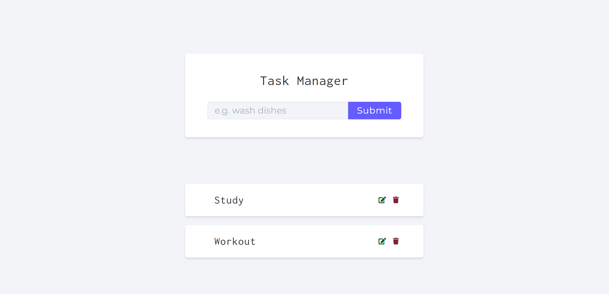
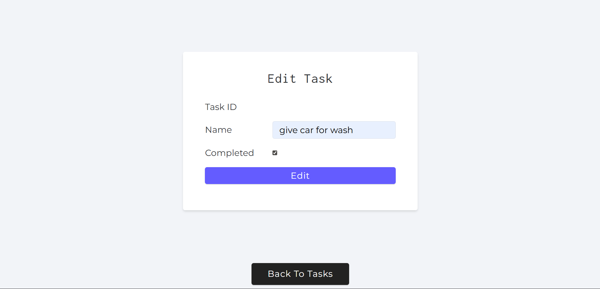
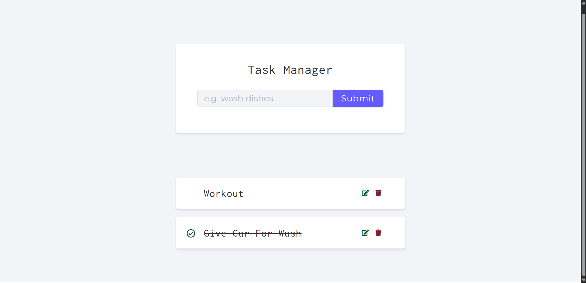

# Task Manager API

## Description

This project is a modular, production-ready REST API built with **Node.js**, **Express**, and **MongoDB**. It implements CRUD operations for tasks, with clean separation of concerns through controllers, middleware, and models.

Currently, it handles task management, but future releases will include **user authentication and login functionality**.

## Techniques Used

- **Async route handling**: Wraps all async controller functions with a custom [`asyncWrapper`](./middleware/async.js) to automatically catch errors and forward them to the error handler.
- **Custom error classes**: Uses [`CustomAPIError`](./errors/custom-error.js) to attach HTTP status codes to errors for structured responses.
- **Express middleware chaining**: Combines static file serving, JSON parsing, routes, 404 handling, and error handling into a clean middleware stack. See [MDN middleware docs](https://developer.mozilla.org/docs/Learn/Server-side/Express_Nodejs/Introduction#middleware).
- **Routing modularity**: Routes are separated using [`express.Router`](./routes/tasks.js) for versioned API endpoints.
- **Mongoose schema validation**: Task model enforces field requirements and validation, e.g., trimming and max length for names. See [Mongoose schema docs](https://mongoosejs.com/docs/guide.html).

## Libraries and Technologies

- [Express](https://expressjs.com/) – web framework for routing and middleware.
- [Mongoose](https://mongoosejs.com/) – MongoDB ODM for schema enforcement and database operations.
- [dotenv](https://www.npmjs.com/package/dotenv) – environment variable management.
- [Google Fonts](https://fonts.google.com/) – any frontend fonts included in `public` (check CSS imports).
- Nodemon (dev) – automatic server reload during development.

## Project Structure

```bash
.
├── controllers/      # Business logic for tasks
├── db/               # Database connection setup
├── errors/           # Custom error classes
├── middleware/       # Async wrapper, error handler, 404 handler
├── models/           # Mongoose models
├── public/           # Frontend files (HTML, CSS, JS, images)
├── routes/           # Express route definitions
├── app.js            # Main server entry point
├── package.json      # Project metadata and dependencies
```

- `controllers/`: Handles CRUD logic for tasks.
- `middleware/`: Centralizes error handling and async wrapper pattern.
- `public/`: Serves static frontend content.

## Frontend Screenshots

### Home Page



### Edit/Update Page



### Home Page Showing Completed Task


